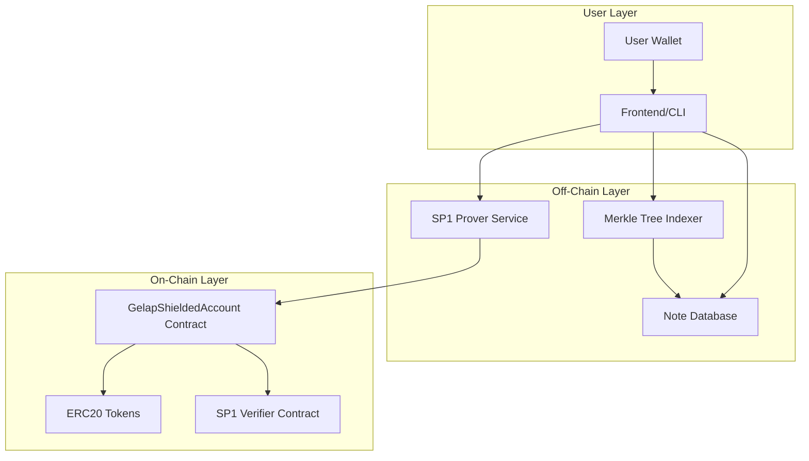
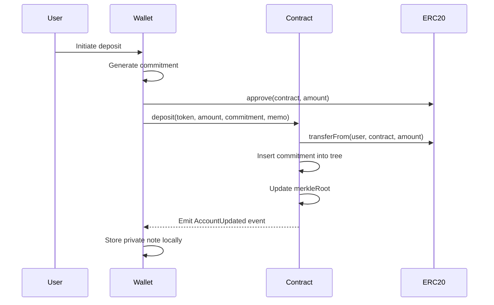
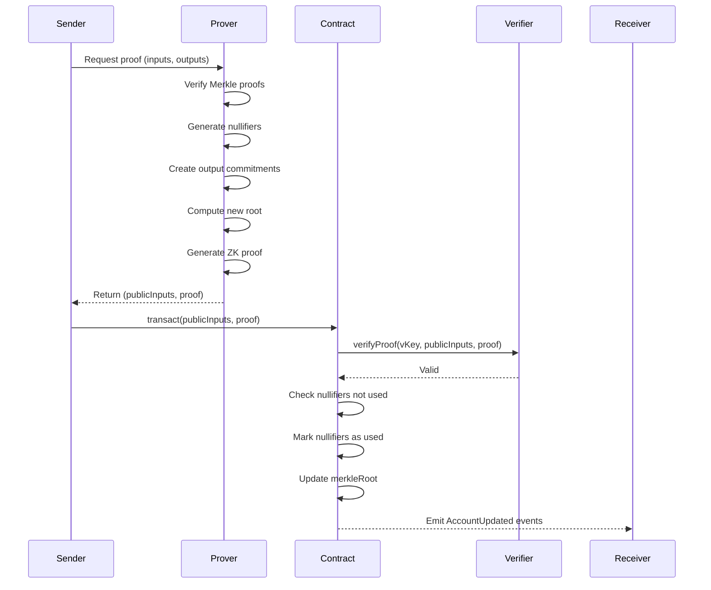
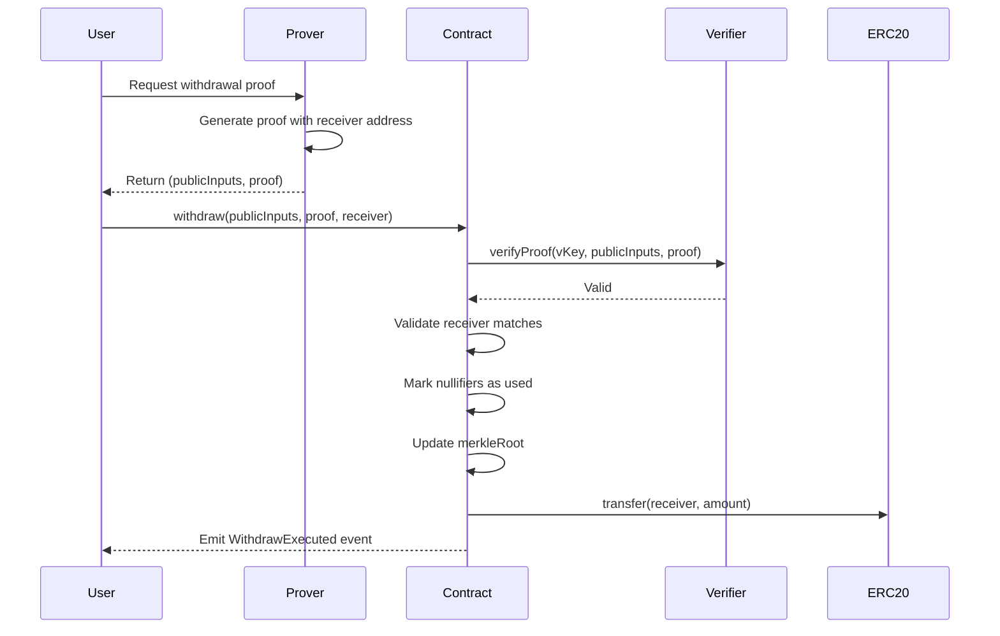

# Gelap Architecture Documentation

## Overview

Gelap is a privacy-preserving shielded pool system that enables private transactions of ERC20 tokens on Ethereum. The system leverages SP1 zkVM (Zero-Knowledge Virtual Machine) to perform heavy cryptographic computations off-chain while maintaining verifiable correctness on-chain.

## System Architecture



## Core Components

### 1. Smart Contract Layer

#### GelapShieldedAccount.sol
The main contract that manages the shielded pool state and validates state transitions.

**Key Responsibilities:**
- Maintain the Merkle tree representing private state
- Track used nullifiers to prevent double-spending
- Verify ZK proofs via SP1 verifier
- Manage ERC20 token deposits and withdrawals
- Emit events for off-chain indexing

**State Variables:**
- `merkleRoot`: Current root of the Merkle tree (32 bytes)
- `nullifierUsed`: Mapping of spent nullifiers
- `tree`: Sparse Merkle tree storage
- `nextLeafIndex`: Index for next leaf insertion
- `zeroHashes`: Precomputed default hashes for empty nodes

### 2. Merkle Tree Structure

**Specifications:**
- **Depth**: 32 levels
- **Capacity**: 2^32 leaves (~4.3 billion commitments)
- **Hash Function**: keccak256
- **Node Storage**: Sparse storage using `(level << 32) | index` as key

**Tree Operations:**
- **Insertion**: Incremental insertion with parent hash computation
- **Zero Hashes**: Precomputed for efficient sparse tree handling
- **Root Computation**: Bottom-up hashing from leaf to root

```
Level 32 (Root)                    [Root Hash]
                                  /          \
Level 31                    [Hash]            [Hash]
                           /      \          /      \
...                      ...      ...      ...      ...
Level 0 (Leaves)    [Leaf1] [Leaf2] [Leaf3] ... [LeafN]
```

### 3. Privacy Primitives

#### Commitments
Pedersen commitments represent private notes containing:
- Token address
- Amount
- Owner's public key
- Blinding factor (randomness)

**Format**: `commitment = Hash(token, amount, owner, blinding)`

#### Nullifiers
Unique identifiers that mark a note as spent without revealing which note.

**Format**: `nullifier = Hash(commitment, secret_key)`

**Properties:**
- Deterministic for the same note and key
- Unlinkable to the original commitment (without secret key)
- Prevents double-spending

### 4. SP1 zkVM Integration

#### Proof Generation (Off-Chain)
The SP1 program executes the following logic:

1. **Input Validation**
   - Verify Merkle inclusion proofs for spent notes
   - Validate ownership via signature/key
   - Check balance sufficiency

2. **Computation**
   - Generate nullifiers for spent notes
   - Create new commitments for outputs
   - Compute new Merkle root

3. **Output**
   - ABI-encoded public inputs
   - ZK proof bytes

#### Proof Verification (On-Chain)
The contract calls `ISP1Verifier.verifyProof()` with:
- `programVKey`: Identifies the SP1 program
- `publicValues`: ABI-encoded state transition
- `proofBytes`: ZK proof

## Transaction Flow

### Deposit Flow



**Steps:**
1. User approves contract to spend ERC20 tokens
2. Wallet generates random blinding factor
3. Wallet computes commitment = Hash(token, amount, pubkey, blinding)
4. User calls `deposit(token, amount, commitment, encryptedMemo)`
5. Contract transfers tokens and inserts commitment
6. Wallet stores private note (commitment, blinding, amount, etc.)

### Private Transaction Flow



**Steps:**
1. Sender selects notes to spend (inputs)
2. Sender defines outputs (recipients and amounts)
3. SP1 prover generates proof of valid state transition
4. Sender submits transaction with proof
5. Contract verifies proof via SP1 verifier
6. Contract checks and marks nullifiers
7. Contract updates Merkle root
8. Receivers detect their new notes via events

### Withdrawal Flow



**Steps:**
1. User requests withdrawal to public address
2. SP1 prover generates proof including receiver address
3. User calls `withdraw(publicInputs, proof, receiver)`
4. Contract verifies proof
5. Contract validates receiver matches proof (anti-front-running)
6. Contract marks nullifiers and updates root
7. Contract transfers ERC20 tokens to receiver

## Security Model

### Threat Model

**Protected Against:**
- ✅ Double-spending (nullifier tracking)
- ✅ Front-running withdrawals (receiver validation)
- ✅ Invalid state transitions (ZK proof verification)
- ✅ Unauthorized token transfers (ERC20 approval required)

**Assumptions:**
- SP1 zkVM soundness and security
- Correct implementation of SP1 program
- Users maintain private key security
- Users backup their private notes

### Privacy Guarantees

**What is Private:**
- Transaction amounts
- Sender identity
- Receiver identity
- Transaction graph (who sent to whom)

**What is Public:**
- Total value locked in contract
- Deposit events (commitment + optional encrypted memo)
- Withdrawal events (receiver, token, amount)
- Number of transactions
- Merkle root changes

## Gas Optimization

### Current Implementation
- Sparse Merkle tree storage (only stores non-zero nodes)
- Incremental tree updates (no full tree recomputation)
- Batch nullifier checking in loops

### Potential Optimizations
- Use assembly for hash operations
- Optimize storage layout
- Batch multiple transactions
- Use calldata instead of memory where possible

## Scalability Considerations

**Current Limits:**
- Maximum 2^32 total deposits
- Linear gas cost per nullifier checked
- Single Merkle root (no parallel trees)

**Future Improvements:**
- Multiple tree roots for parallel deposits
- Rollup integration for cheaper transactions
- Optimistic verification patterns

## Integration Points

### For Wallet Developers
- Listen to `AccountUpdated` events
- Maintain local note database
- Implement note selection algorithm
- Handle encrypted memos

### For Indexers
- Track all `AccountUpdated` events
- Build Merkle tree state
- Index nullifiers
- Provide note discovery service

### For Prover Services
- Implement SP1 program logic
- Provide proof generation API
- Cache Merkle proofs
- Optimize proof generation time
