# Gelap System Design

## Table of Contents

1. [High-Level Overview](#high-level-overview)
2. [System Architecture](#system-architecture)
3. [Component Design](#component-design)
4. [Data Flow](#data-flow)
5. [State Management](#state-management)
6. [Cryptographic Design](#cryptographic-design)
7. [Network Architecture](#network-architecture)
8. [Scalability Design](#scalability-design)
9. [Privacy Design](#privacy-design)
10. [Security Architecture](#security-architecture)

---

## High-Level Overview

### System Purpose

Gelap is a **privacy-preserving shielded pool protocol** that enables confidential transactions of ERC20 tokens on Ethereum and EVM-compatible chains. It uses zero-knowledge proofs to hide transaction details while maintaining verifiable correctness.

### Key Design Goals

1. **Privacy**: Hide transaction amounts, senders, and receivers
2. **Security**: Prevent double-spending and invalid state transitions
3. **Decentralization**: No trusted third parties
4. **Composability**: Work with any ERC20 token
5. **Efficiency**: Optimize gas costs and proof generation time
6. **Usability**: Simple developer and user experience

### System Boundaries

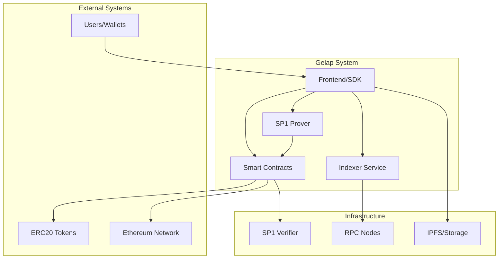

---

## System Architecture

### Layered Architecture

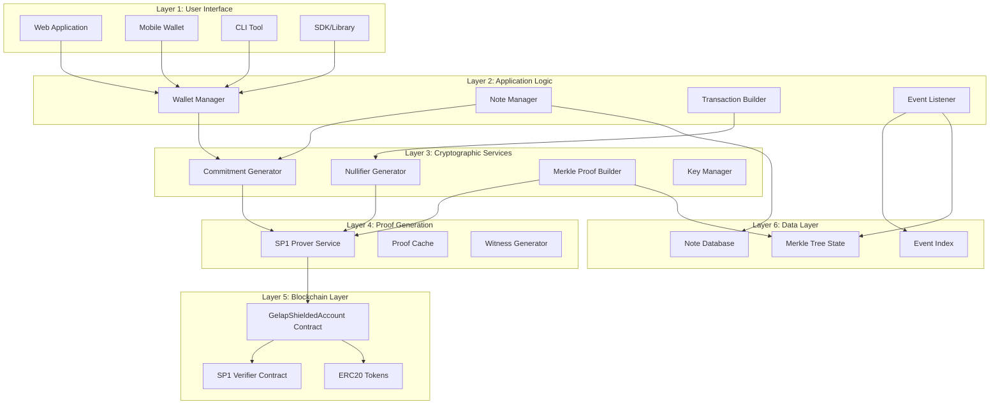

### Component Interaction

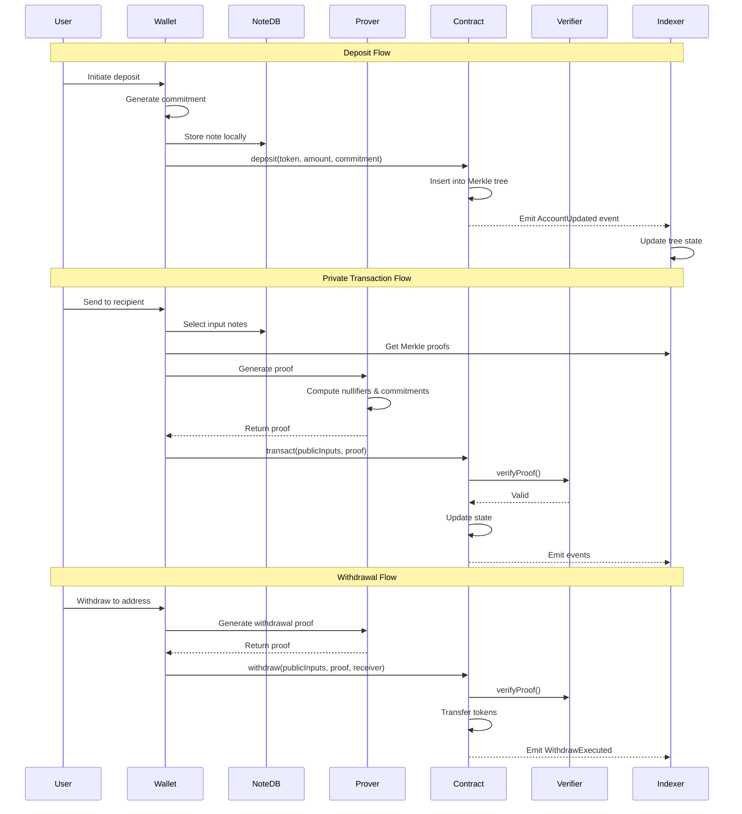

---

## Component Design

### 1. Smart Contract Layer

#### GelapShieldedAccount Contract

**Responsibilities:**
- Manage Merkle tree state
- Validate ZK proofs
- Track nullifiers
- Handle token transfers
- Emit state change events

**State Variables:**
```solidity
contract GelapShieldedAccount {
    // Merkle tree state
    bytes32 public merkleRoot;
    mapping(uint256 => bytes32) public tree;
    uint32 public nextLeafIndex;
    bytes32[32] public zeroHashes;
    
    // Nullifier tracking
    mapping(bytes32 => bool) public nullifierUsed;
    
    // SP1 configuration
    address public sp1Verifier;
    bytes32 public sp1ProgramVKey;
}
```

**Design Patterns:**
- **Sparse Merkle Tree**: Only store non-zero nodes
- **Incremental Updates**: Compute only affected nodes
- **Event-Driven**: Emit events for off-chain indexing
- **Fail-Fast**: Validate inputs early

### 2. SP1 Prover Service

#### Architecture

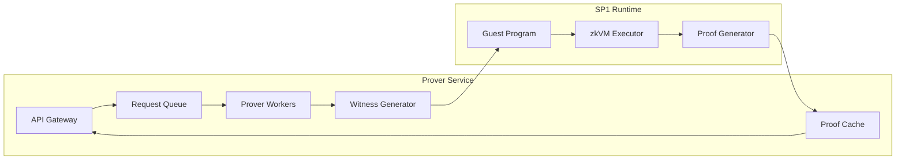

**Components:**

1. **API Gateway**: REST/gRPC interface for proof requests
2. **Request Queue**: Async job processing (Redis/RabbitMQ)
3. **Prover Workers**: Parallel proof generation
4. **Proof Cache**: Cache proofs for common patterns
5. **Witness Generator**: Prepare inputs for zkVM

**Scaling Strategy:**
- Horizontal scaling of workers
- Load balancing across instances
- Proof caching for efficiency
- GPU acceleration support

### 3. Indexer Service

#### Purpose
Track all contract events and maintain synchronized state for wallets.

#### Architecture

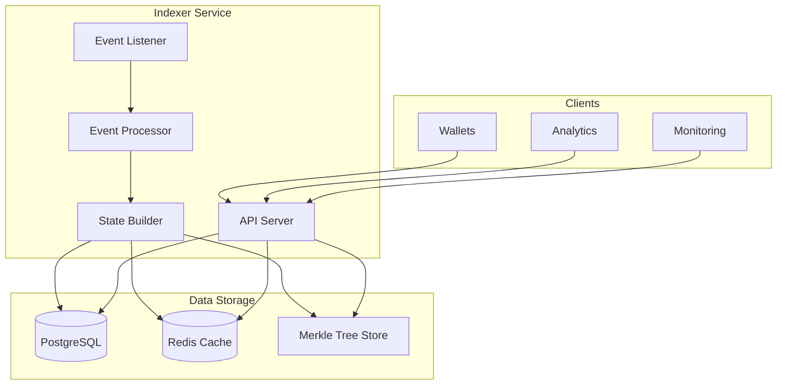

**Database Schema:**

```sql
-- Commitments table
CREATE TABLE commitments (
    id SERIAL PRIMARY KEY,
    commitment BYTEA NOT NULL,
    leaf_index INTEGER NOT NULL,
    block_number BIGINT NOT NULL,
    tx_hash BYTEA NOT NULL,
    encrypted_memo BYTEA,
    created_at TIMESTAMP DEFAULT NOW()
);

-- Nullifiers table
CREATE TABLE nullifiers (
    id SERIAL PRIMARY KEY,
    nullifier BYTEA NOT NULL UNIQUE,
    block_number BIGINT NOT NULL,
    tx_hash BYTEA NOT NULL,
    spent_at TIMESTAMP DEFAULT NOW()
);

-- Merkle roots table
CREATE TABLE merkle_roots (
    id SERIAL PRIMARY KEY,
    root BYTEA NOT NULL,
    leaf_count INTEGER NOT NULL,
    block_number BIGINT NOT NULL,
    created_at TIMESTAMP DEFAULT NOW()
);

-- Withdrawals table
CREATE TABLE withdrawals (
    id SERIAL PRIMARY KEY,
    receiver BYTEA NOT NULL,
    token BYTEA NOT NULL,
    amount NUMERIC(78, 0) NOT NULL,
    block_number BIGINT NOT NULL,
    tx_hash BYTEA NOT NULL,
    created_at TIMESTAMP DEFAULT NOW()
);
```

### 4. Wallet/SDK

#### Note Management

```typescript
interface Note {
  commitment: string;      // 32 bytes
  token: string;          // 20 bytes (address)
  amount: bigint;         // uint256
  owner: string;          // 32 bytes (public key)
  blinding: string;       // 32 bytes (random)
  leafIndex?: number;     // Position in tree
  spent: boolean;         // Spent status
}

class NoteManager {
  private notes: Map<string, Note>;
  private db: Database;
  
  async addNote(note: Note): Promise<void>;
  async markSpent(commitment: string): Promise<void>;
  async getUnspentNotes(token: string): Promise<Note[]>;
  async selectNotes(amount: bigint): Promise<Note[]>;
  async syncFromChain(): Promise<void>;
}
```

#### Transaction Builder

```typescript
class TransactionBuilder {
  async buildDeposit(
    token: string,
    amount: bigint
  ): Promise<DepositTx>;
  
  async buildTransfer(
    inputs: Note[],
    outputs: Output[]
  ): Promise<TransferTx>;
  
  async buildWithdrawal(
    inputs: Note[],
    token: string,
    amount: bigint,
    receiver: string
  ): Promise<WithdrawalTx>;
}
```

---

## Data Flow

### Deposit Data Flow

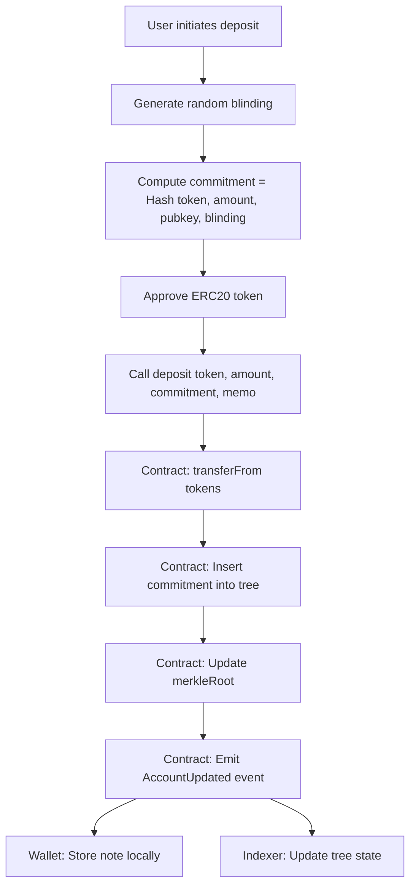

### Private Transaction Data Flow

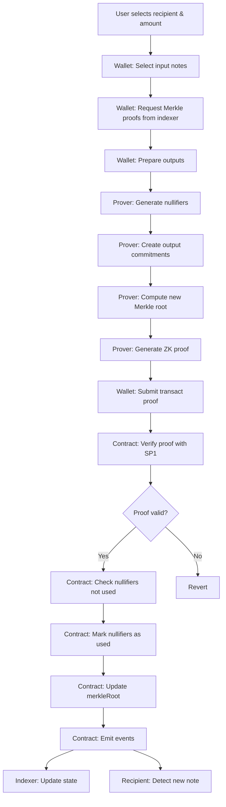

### Withdrawal Data Flow

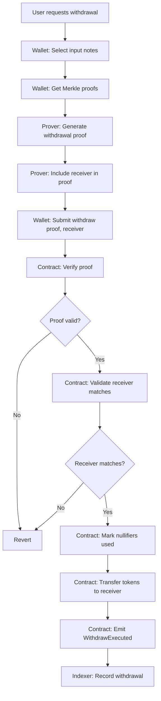

---

## State Management

### On-Chain State

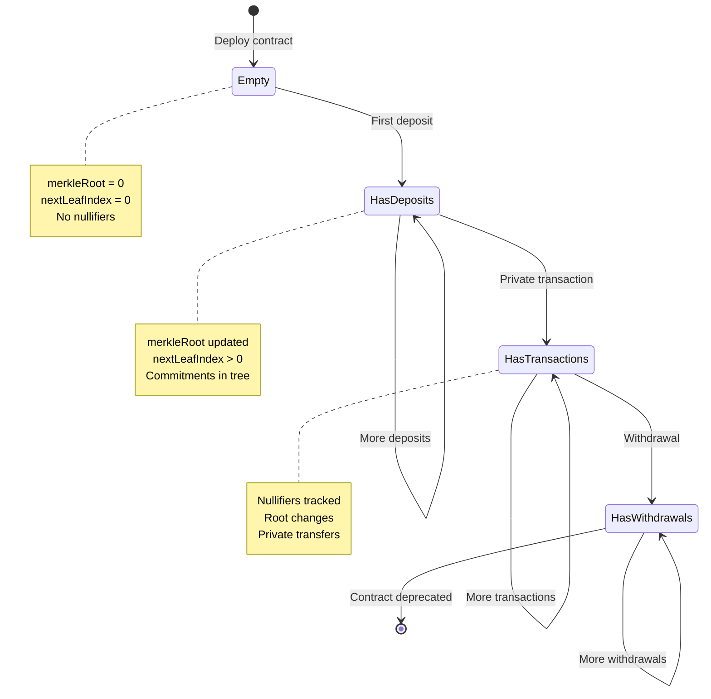

### Merkle Tree State

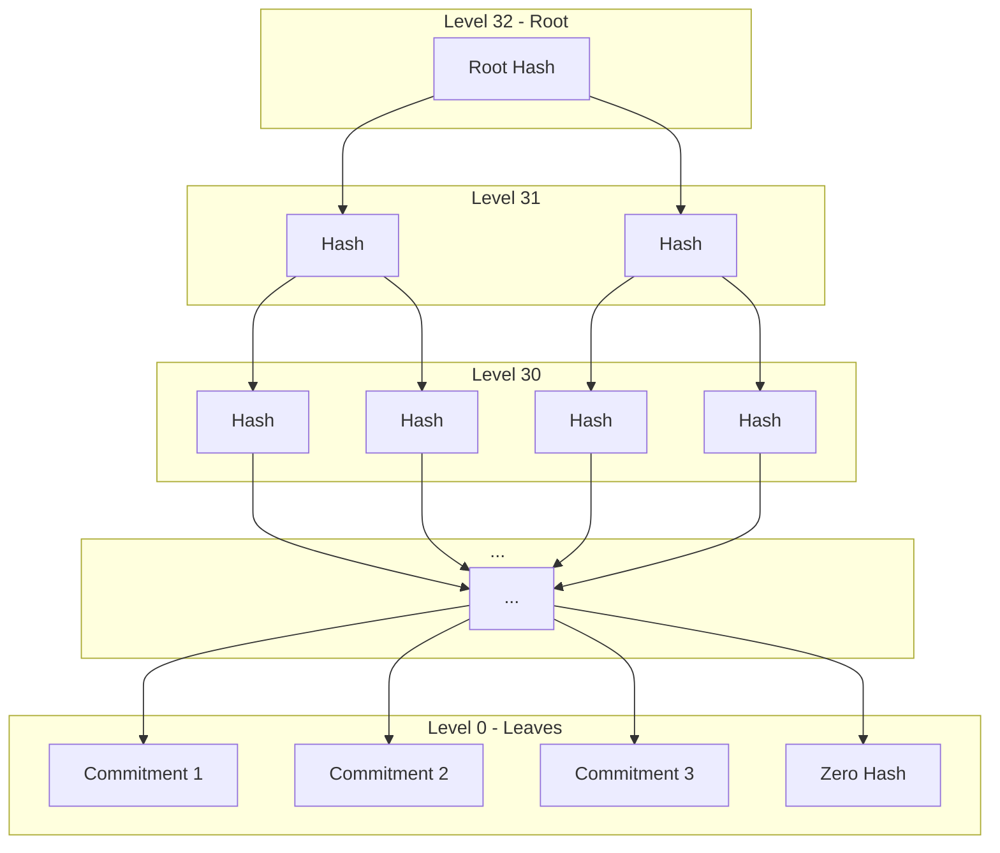

**State Transitions:**

1. **Deposit**: Add leaf → Recompute path to root
2. **Transaction**: Verify old root → Compute new root
3. **Withdrawal**: Same as transaction + token transfer

### Off-Chain State

**Wallet State:**
```typescript
interface WalletState {
  notes: Note[];              // Owned notes
  spentNotes: Set<string>;    // Spent commitments
  pendingTxs: Transaction[];  // Unconfirmed transactions
  syncedBlock: number;        // Last synced block
}
```

**Indexer State:**
```typescript
interface IndexerState {
  currentRoot: string;
  leafCount: number;
  treeNodes: Map<string, string>;
  nullifiers: Set<string>;
  lastBlock: number;
}
```

---

## Cryptographic Design

### Commitment Scheme

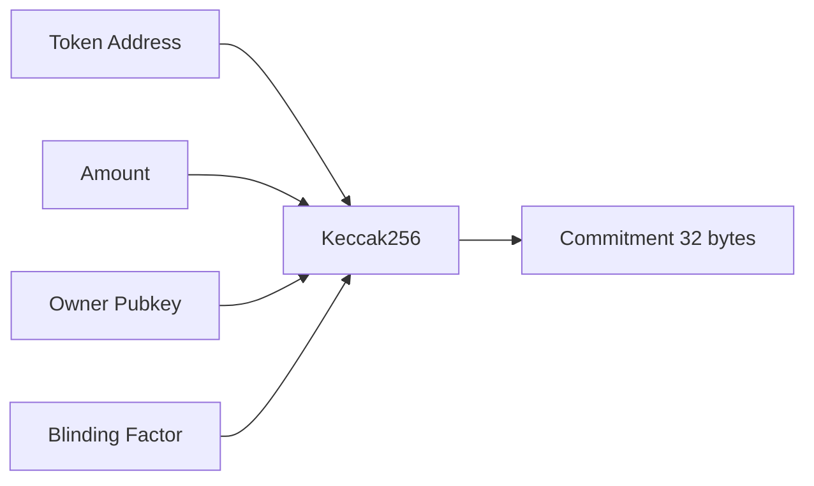

**Properties:**
- **Hiding**: Blinding factor hides content
- **Binding**: Cannot change values after commitment
- **Deterministic**: Same inputs → same output
- **Collision-resistant**: Hard to find two inputs with same output

### Nullifier Scheme

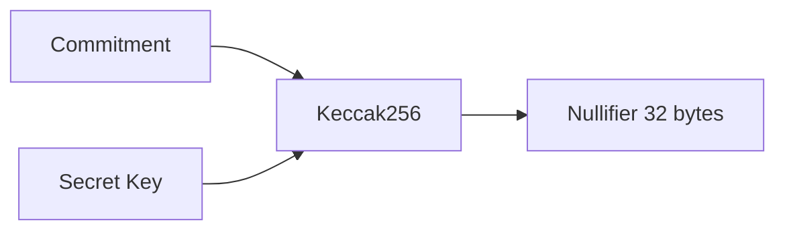

**Properties:**
- **Uniqueness**: One nullifier per note
- **Unlinkability**: Cannot link to commitment without secret
- **Deterministic**: Same note + key → same nullifier
- **One-time use**: Prevents double-spending

### Merkle Tree Hashing

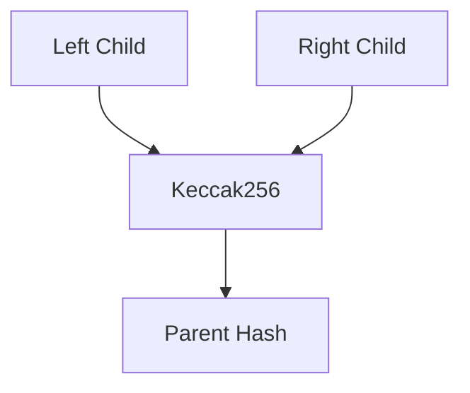

**Properties:**
- **Incremental**: Only recompute affected path
- **Sparse**: Use zero hashes for empty nodes
- **Efficient**: O(log n) proof size
- **Secure**: Collision-resistant hash function

### Zero-Knowledge Proof

**Public Inputs:**
- New Merkle root
- Nullifiers
- New commitments
- (For withdrawal) Token, amount, receiver

**Private Inputs:**
- Input notes (token, amount, owner, blinding)
- Merkle proofs
- Secret key
- Output recipients

**Proof Statement:**
```
PROVE that:
  1. I know notes with valid Merkle proofs
  2. I know the secret key for these notes
  3. Sum(inputs) = Sum(outputs)
  4. Nullifiers are correctly computed
  5. New commitments are correctly formed
  6. New root is correctly computed
```

---

## Network Architecture

### Multi-Chain Deployment

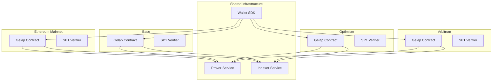

### Service Topology

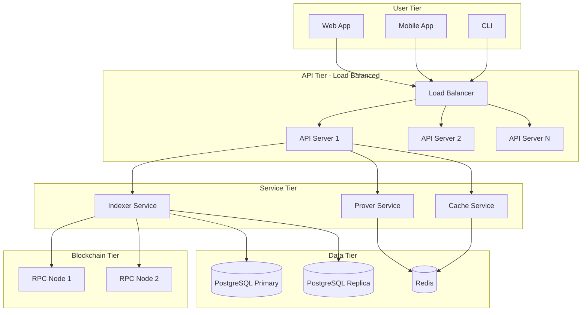

---

## Scalability Design

### Horizontal Scaling

**Prover Service:**
- Stateless workers
- Queue-based job distribution
- Auto-scaling based on load
- GPU acceleration

**Indexer Service:**
- Read replicas for queries
- Write to primary only
- Event processing pipeline
- Caching layer

**API Servers:**
- Stateless REST/GraphQL
- Load balancer distribution
- CDN for static content
- Rate limiting per user

### Vertical Optimization

**Smart Contract:**
- Sparse tree storage
- Batch nullifier checks
- Optimized hash operations
- Minimal storage writes

**Prover:**
- Parallel witness generation
- Proof caching
- Incremental proving
- Hardware acceleration

### Capacity Planning

**Merkle Tree:**
- Max capacity: 2^32 leaves (4.3B)
- At 1000 deposits/day: ~11,780 years
- Monitor at 50% capacity
- Plan migration at 75%

**Database:**
- Partition by time ranges
- Archive old data
- Index optimization
- Regular vacuum

---

## Privacy Design

### Privacy Layers

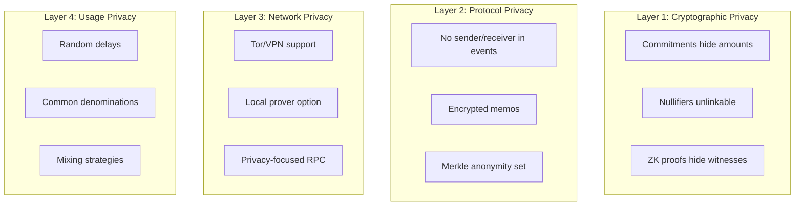

### Anonymity Set

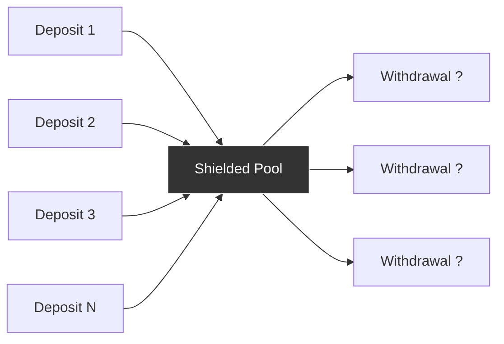

**Anonymity Set Size = Total Deposits**

Larger set = Better privacy

### Privacy Guarantees

| Aspect | Privacy Level | Notes |
|--------|--------------|-------|
| Transaction Amount | ✅ Hidden | Except withdrawals |
| Sender Identity | ✅ Hidden | Always |
| Receiver Identity | ✅ Hidden | Except withdrawals |
| Transaction Graph | ✅ Hidden | Cannot link txs |
| Deposit Amount | ❌ Public | Visible on-chain |
| Withdrawal Amount | ❌ Public | Visible on-chain |
| Total Pool Value | ❌ Public | Sum of deposits |

---

## Security Architecture

### Defense in Depth

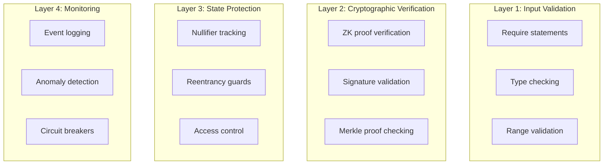

### Attack Surface Analysis

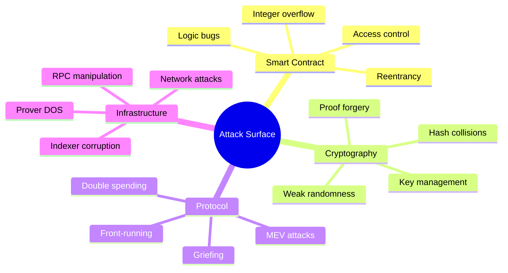

### Security Controls

| Threat | Control | Implementation |
|--------|---------|----------------|
| Double-spend | Nullifier tracking | `mapping(bytes32 => bool)` |
| Invalid proofs | SP1 verification | `ISP1Verifier.verifyProof()` |
| Front-running | Receiver validation | `require(pub.receiver == receiver)` |
| Reentrancy | Checks-Effects-Interactions | State updates before external calls |
| Integer overflow | Solidity 0.8+ | Built-in overflow checks |
| Unauthorized access | Permissionless design | No admin functions |

---

## Deployment Architecture

### Infrastructure Diagram

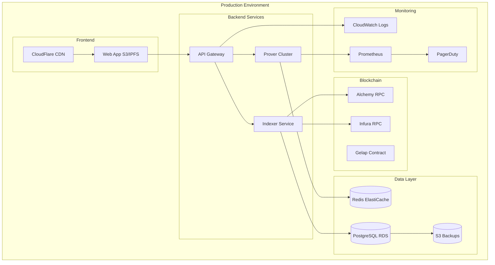

---

## Conclusion

This system design provides a comprehensive blueprint for building a production-ready privacy-preserving shielded pool. The architecture balances privacy, security, scalability, and usability while maintaining decentralization principles.

### Key Design Decisions

1. **SP1 zkVM**: Modern, developer-friendly ZK framework
2. **Sparse Merkle Tree**: Efficient storage and updates
3. **Event-Driven**: Decoupled components via events
4. **Stateless Services**: Horizontal scalability
5. **Defense in Depth**: Multiple security layers

### Next Steps

1. Implement core components
2. Deploy to testnet
3. Security audit
4. Performance optimization
5. Production deployment
