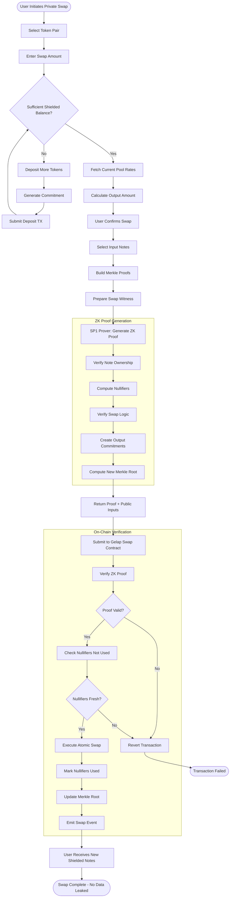
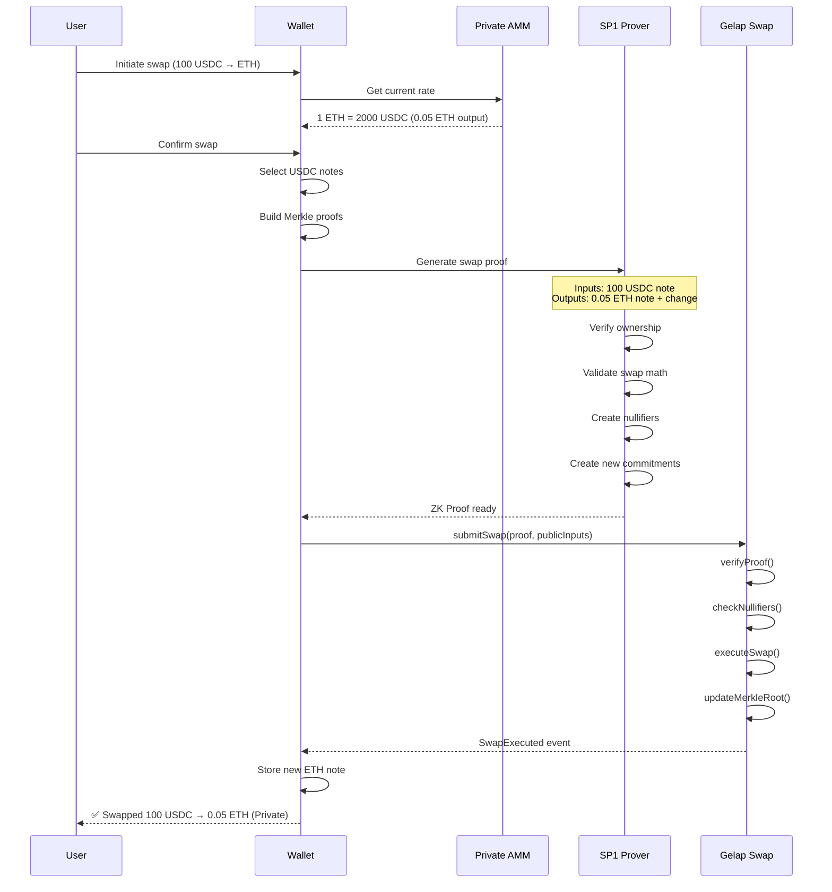

# Private Swap - Confidential Token Exchange

> **"As a trader, I can swap 1000 ETH → USDC without any bot seeing my order or front-running my price."**

## Overview

**Private Swap** is Gelap's private AMM that ensures your trading intent remains invisible until execution.

### What It Solves

- **MEV Bots:** On public DEXs, bots see your order in the mempool and "sandwich" it, giving you a worse price.
- **Copy Trading:** Competitors track profitable wallets to copy their moves.
- **Market Impact:** Large orders panic the market before they even settle.

### How Private Swap Protects You

- ✅ **Hidden Amounts:** Swaps occur inside a Zero-Knowledge proof; observers see a transaction but not the volume.
- ✅ **Hidden Identity:** Your wallet address is never linked to the swap.
- ✅ **Zero Front-Running:** Since the trade details are hidden, bots cannot profitably target you.

---

## How It Works

### Step-by-Step Flow

1. **User has shielded tokens** (already deposited into Gelap)
2. **Select token pair** (e.g., USDC → ETH)
3. **Enter swap amount** (only visible to user's wallet)
4. **ZK proof generated locally** — proves the swap is valid without revealing details
5. **Proof submitted on-chain** — contract verifies proof, executes swap
6. **User receives new shielded tokens** — output tokens remain private

---

## Activity Diagram



---

## Sequence Flow



---

## What the ZK Proof Proves

The ZK proof cryptographically guarantees:

```
PROVE:
  1. I own input notes worth X of Token A
  2. Output amount Y of Token B is correct per AMM formula
  3. Nullifiers are correctly derived
  4. New commitments are valid
  5. No tokens created or destroyed
```

---

## What's Private vs Public

| Data Point           | Status                    |
| -------------------- | ------------------------- |
| Swap amount          | 🔒 Private                |
| Token types          | 🔒 Private                |
| User address         | 🔒 Private                |
| Swap rate used       | 🔒 Private                |
| Swap occurred        | 🌐 Public (event emitted) |
| Pool total liquidity | 🌐 Public                 |

---

## Private AMM Pool

```
┌─────────────────────────────────────┐
│        SHIELDED LIQUIDITY POOL      │
├─────────────────────────────────────┤
│  Token A Pool ◄──────► Token B Pool │
│       │                    │        │
│  [Hidden Balances via Commitments]  │
│                                     │
│  Swap = ZK Proof of valid trade     │
└─────────────────────────────────────┘
```

---

## Key Benefits

| 🔐 TRADE PRIVATELY | No one sees your positions |
|🛡️ MEV PROTECTED | Zero front-running possible |
| 📊 NO TRACKING | Break address correlation |
| ⚡ INSTANT FINALITY | Mantle L2 speed |
| 💰 LOW FEES | ~$0.01-0.05 per swap │

```
┌─────────────────────────────────────────────────────────────┐
│  🔐 TRADE PRIVATELY      No one sees your positions        │
│  🛡️ MEV PROTECTED        Zero front-running possible       │
│  📊 NO TRACKING          Break address correlation         │
│  ⚡ INSTANT FINALITY     Mantle L2 speed                   │
│  💰 LOW FEES             ~$0.01-0.05 per swap              │
└─────────────────────────────────────────────────────────────┘
```
