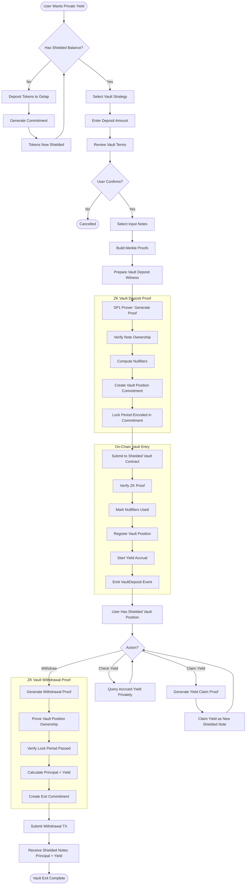
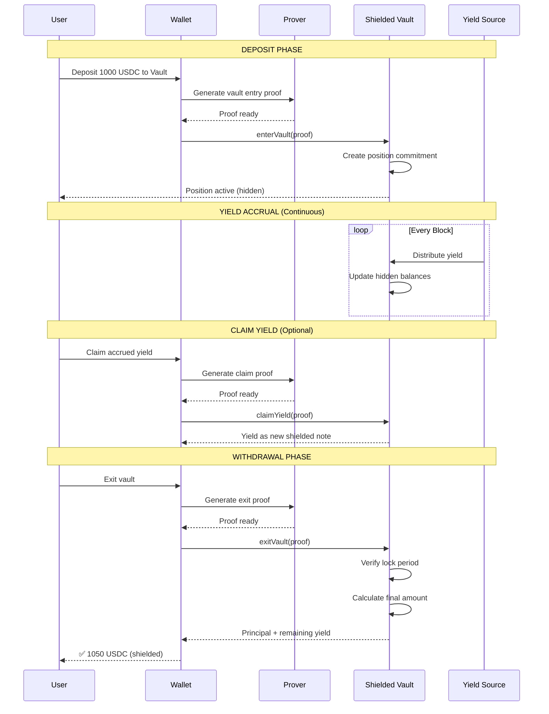

# Shielded Vault - Private Yield Farming

> **"As a whale, I can earn yield on $10M USDC without hackers or competitors tracking my wallet address."**

## Overview

**Shielded Vault** allows you to deposit assets into yield-generating strategies while keeping your position size and earnings completely hidden.

### What It Solves

- **Wealth Signaling:** Large deposits attract hackers and scammers.
- **Strategy Leakage:** Competitors monitor whale wallets to copy or counter-trade their positions.
- **Financial Privacy:** You shouldn't have to reveal your entire bank balance just to earn interest.

### How Shielded Vault Protects You

- ✅ **Private Deposits:** No one knows how much you entered with.
- ✅ **Hidden Accrual:** Yield grows "in the dark" — invisible on-chain.
- ✅ **Anonymous Exit:** Withdraw principal and yield to a fresh address without linking it to the deposit.

---

## How It Works

### Step-by-Step Flow

1. **Deposit:** Tokens enter privacy pool and become invisible
2. **Earn:** Yield accrues to your hidden position
3. **Claim:** Harvest earnings as new private tokens (optional)
4. **Withdraw:** Exit with principal + yield anytime

---

## Activity Diagram



---

## Vault Position Lifecycle



---

## Vault Position Structure

Each vault position is represented by a cryptographic commitment:

```
┌─────────────────────────────────────────────────┐
│           SHIELDED VAULT POSITION               │
├─────────────────────────────────────────────────┤
│                                                 │
│   Position Commitment = Hash(                  │
│     principal_amount,                          │
│     entry_timestamp,                           │
│     lock_period,                               │
│     owner_pubkey,                              │
│     vault_id,                                  │
│     blinding_factor                            │
│   )                                            │
│                                                 │
│   ┌───────────────────────────────────────┐    │
│   │  Only owner can prove:                │    │
│   │  - They own this position             │    │
│   │  - Lock period status                 │    │
│   │  - Accrued yield amount               │    │
│   └───────────────────────────────────────┘    │
│                                                 │
└─────────────────────────────────────────────────┘
```

---

## Privacy Guarantees

| Data Point          | Visibility |
| ------------------- | ---------- |
| Deposit amount      | 🔒 Private |
| Depositor identity  | 🔒 Private |
| Vault position size | 🔒 Private |
| Yield earned        | 🔒 Private |
| Withdrawal amount   | 🔒 Private |
| Total vault TVL     | 🌐 Public  |
| Vault APY           | 🌐 Public  |

---

## Supported Vault Strategies

| Strategy          | Description                 | Risk    |
| ----------------- | --------------------------- | ------- |
| **Stable Yield**  | Lending USDC/USDT           | Low     |
| **LP Farming**    | Provide liquidity privately | Medium  |
| **Restaking**     | Stake LSTs for extra yield  | Medium  |
| **Delta Neutral** | Market-neutral strategies   | Low-Med |

---

## Key Benefits

```
┌─────────────────────────────────────────────────┐
│  🔐 PRIVACY         No one sees your holdings   │
│  📈 YIELD           Earn while staying private  │
│  🛡️ SECURITY        ZK-verified positions       │
│  💧 FLEXIBILITY     Claim yield anytime         │
│  🔗 COMPOSABLE      Stack with other DeFi       │
└─────────────────────────────────────────────────┘
```
