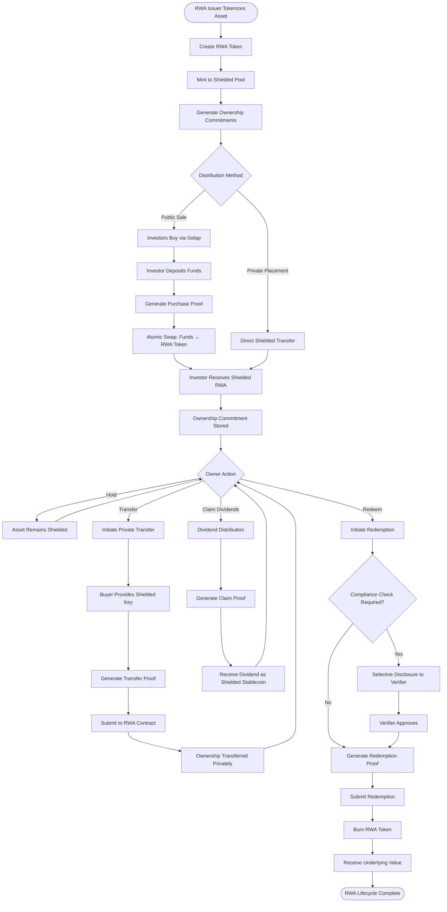
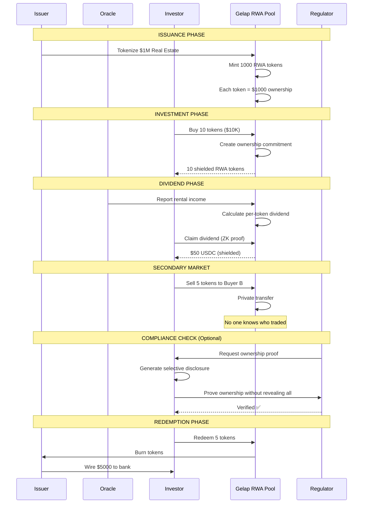

# Confidential RWA - Private Real-World Asset Ownership

> **"As an institution, I can trade T-Bills and stock assets without leaking my Net Asset Value (NAV) to the market."**

## Overview

**Confidential RWA** enables compliant, private ownership of tokenized real-world assets. It bridges traditional finance with blockchain while respecting institutional requirements for confidentiality.

### What It Solves

- **NAV Leakage:** Hedge funds and institutions cannot have their exact portfolio value tracked in real-time by the public.
- **Competitive Disadvantage:** Revealing asset accumulation strategies allows others to front-run or counter-trade.
- **Data Sovereignty:** Institutions have a fiduciary duty to protect client data, which public blockchains often violate.

### How Confidential RWA Protects You

- ✅ **Hidden Ownership:** The ledger records that assets exist, but not who holds them.
- **Compliant Transfers:** Assets can only move between compliant addresses (if required), but the movement itself is private.
- **Private Dividends:** Interest/Rent payments are distributed without revealing the recipient's identity.

---

## Supported RWA Types

| Asset Class            | Token Representation | Yield Type         |
| ---------------------- | -------------------- | ------------------ |
| **Real Estate**        | Fractional ownership | Rental income      |
| **Bonds**              | Debt tokens          | Interest payments  |
| **Commodities**        | Warehouse receipts   | Price appreciation |
| **Private Equity**     | Share tokens         | Dividends          |
| **Invoices**           | Receivable tokens    | Discount yield     |
| **Art & Collectibles** | Fractional NFTs      | Sale proceeds      |

---

## How It Works

### RWA Lifecycle

1. **Issuance:** Issuer tokenizes real-world asset into Gelap pool
2. **Investment:** Investors buy RWA tokens with shielded funds
3. **Ownership:** Holdings stored as private commitments
4. **Trading:** Secondary market trades with full privacy
5. **Dividends:** Claim income as shielded stablecoins
6. **Redemption:** Exit by burning tokens for underlying value

---

## Activity Diagram



---

## RWA Token Lifecycle Sequence



---

## RWA Ownership Commitment Structure

```
┌─────────────────────────────────────────────────────┐
│            RWA OWNERSHIP COMMITMENT                 │
├─────────────────────────────────────────────────────┤
│                                                     │
│   Commitment = Hash(                                │
│     rwa_token_address,     // Which RWA             │
│     amount,                // Number of units       │
│     owner_shielded_key,    // Owner identity        │
│     acquisition_date,      // For tax purposes      │
│     jurisdiction_hash,     // Compliance metadata   │
│     blinding_factor        // Privacy randomness    │
│   )                                                 │
│                                                     │
│   ┌───────────────────────────────────────────┐     │
│   │  Selective Disclosure Capabilities:       │     │
│   │  • Prove ownership without revealing amt  │     │
│   │  • Prove holding period for tax benefits  │     │
│   │  • Prove jurisdiction for compliance      │     │
│   └───────────────────────────────────────────┘     │
│                                                     │
└─────────────────────────────────────────────────────┘
```

---

## Privacy vs Compliance Matrix

```
┌──────────────────┬─────────────────────┬───────────────-────┐
│                  │  PRIVATE (Default)  │  DISCLOSED         │
├──────────────────┼─────────────────────┼───────────────-────┤
│ Owner Identity   │  🔒 Hidden          │  📋 To Regulator  │
│ Holding Amount   │  🔒 Hidden          │  📋 On Request    │
│ Transaction Hist │  🔒 Hidden          │  📋 For Audit     │
│ Dividend Claims  │  🔒 Hidden          │  📋 Tax Reporting │
├──────────────────┼─────────────────────┼───────────────-────┤
│ Asset Existence  │  🌐 Public          │  🌐 Public        │
│ Total Supply     │  🌐 Public          │  🌐 Public        │
│ Issuer Info      │  🌐 Public          │  🌐 Public        │
└──────────────────┴─────────────-───────┴───────────────-────┘
```

| Feature          | Private (Default) | Disclosed        |
| :--------------- | :---------------- | :--------------- |
| Owner Identity   | 🔒 Hidden         | 📋 To Regulator  |
| Holding Amount   | 🔒 Hidden         | 📋 On Request    |
| Transaction Hist | 🔒 Hidden         | 📋 For Audit     |
| Dividend Claims  | 🔒 Hidden         | 📋 Tax Reporting |
|                  |                   |                  |
| Asset Existence  | 🌐 Public         | 🌐 Public        |
| Total Supply     | 🌐 Public         | 🌐 Public        |
| Issuer Info      | 🌐 Public         | 🌐 Public        |

---

## Integration with Traditional Finance

```
┌──────────────┐     ┌──────────────┐     ┌──────────────┐
│   ISSUER     │     │   GELAP      │     │  INVESTORS   │
│              │     │   RWA POOL   │     │              │
│  Bank/Fund   │────►│              │◄────│  Retail      │
│  Real Estate │     │  Private     │     │  Institution │
│  Corporation │     │  Ownership   │     │  Family Off. │
└──────────────┘     └──────────────┘     └──────────────┘
       │                    │                    │
       ▼                    ▼                    ▼
  ┌─────────┐         ┌─────-─────┐         ┌───────────┐
  │ Tokenize│         │ Shielded  │         │ Compliant │
  │ Assets  │         │ Trading   │         │ Privacy   │
  └─────────┘         └───────────┘         └───────────┘
```

---

## Key Benefits

```
┌─────────────────────────────────────────────────────────┐
│  🏢 REAL ESTATE    Trade property shares privately      │
│  🏦 INSTITUTIONS   Confidential large-block trades      │
│  🌍 CROSS-BORDER   Avoid revealing wealth to hostiles   │
│  📊 COMPLIANCE     Selective disclosure when needed     │
│  💰 DIVIDENDS      Receive income privately             │
│  🔄 LIQUIDITY      24/7 private secondary market        │
└─────────────────────────────────────────────────────────┘
```
