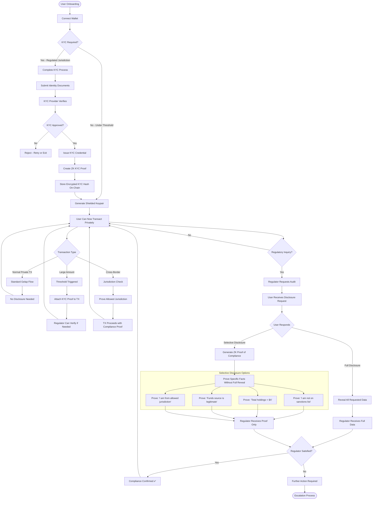
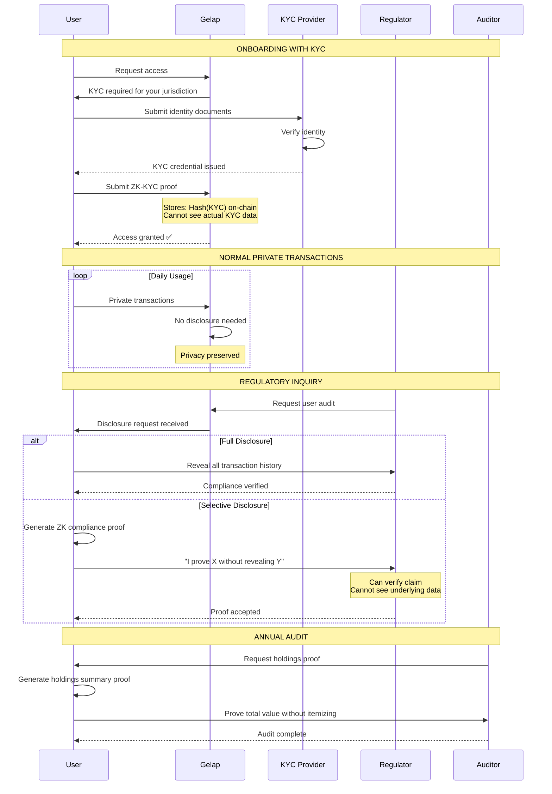

# Compliance Ready - Institutional Frame

> **"As an institution, I can prove clean funds to auditors without exposing my entire transaction history to the public."**
>
> _Privacy by default. Compliance by choice._

## Overview

**Compliance Ready** is a pro-institutional framework that solves the "Privacy vs. Compliance" dilemma. It allows organizations to operate with full privacy by default while retaining the ability to cryptographically prove compliance to auditors and regulators when required.

### What It Solves

- **The Glass House Problem:** Full transparency prevents institutional adoption because it exposes trade secrets and proprietary positions.
- **Regulatory Blocking:** Privacy tools are often banned by regulators due to lack of oversight.
- **Audit Friction:** Traditional audits are slow and expensive; on-chain compliance needs to be efficient.

### How It Works

- ✅ **Privacy by Default:** Normal operations are completely shielded from public view.
- ✅ **Selective Disclosure:** Institutions can generate ZK proofs that reveal _specific_ data (e.g., "I am not on a sanctions list") without revealing _all_ data (e.g., "I own $50M").
- ✅ **Automated Reporting:** Compliance proofs can be attached to transactions automatically based on value thresholds.

---

## Three Modes of Operation

1. **Normal Transactions** — Fully private, no disclosure needed
2. **Threshold-Triggered** — Large amounts attach compliance proofs automatically
3. **Regulatory Inquiry** — Selective disclosure on demand

---

## Activity Diagram



---

## Compliance Flow Sequence



---

## ZK Compliance Proofs

### What Can Be Proven (Without Revealing Raw Data)

| Proof Type          | What User Proves             | What Stays Hidden  |
| ------------------- | ---------------------------- | ------------------ |
| **Identity**        | "I completed KYC"            | Name, DOB, Address |
| **Jurisdiction**    | "I'm from allowed country"   | Exact location     |
| **Sanctions**       | "I'm not sanctioned"         | Full identity      |
| **Threshold**       | "Holdings < $10M"            | Exact amount       |
| **Source of Funds** | "Funds from salary/business" | Employer details   |
| **Age**             | "I'm over 18"                | Actual age         |
| **Accredited**      | "I'm accredited investor"    | Net worth details  |

---

## Compliance Architecture

```
┌─────────────────────────────────────────────────────────────┐
│                    GELAP COMPLIANCE LAYER                   │
├─────────────────────────────────────────────────────────────┤
│                                                             │
│   ┌─────────────┐   ┌─────────────┐   ┌─────────────┐      │
│   │   USER      │   │   GELAP     │   │  REGULATOR  │      │
│   │             │   │   POOL      │   │             │      │
│   └──────┬──────┘   └──────┬──────┘   └──────┬──────┘      │
│          │                 │                 │              │
│          ▼                 ▼                 ▼              │
│   ┌─────────────────────────────────────────────────┐      │
│   │              ZK COMPLIANCE PROOFS               │      │
│   ├─────────────────────────────────────────────────┤      │
│   │  • KYC Credential (hashed on-chain)            │      │
│   │  • Jurisdiction Proof                          │      │
│   │  • Sanctions Screening Proof                   │      │
│   │  • Transaction Threshold Proof                 │      │
│   │  • Source of Funds Proof                       │      │
│   └─────────────────────────────────────────────────┘      │
│          │                 │                 │              │
│          ▼                 ▼                 ▼              │
│   ┌──────────────┐  ┌──────────────┐  ┌──────────────┐     │
│   │  PRIVACY     │  │  VERIFIABLE  │  │  AUDITABLE   │     │
│   │  BY DEFAULT  │  │  ON DEMAND   │  │  WHEN NEEDED │     │
│   └──────────────┘  └──────────────┘  └──────────────┘     │
│                                                             │
└─────────────────────────────────────────────────────────────┘
```

---

## Threshold-Based Compliance

```
┌─────────────────────────────────────────────────────────────┐
│                   TRANSACTION THRESHOLDS                    │
├────────────────┬────────────────────────────────────────────┤
│  < $1,000      │  No KYC required                          │
│  $1K - $10K    │  Basic KYC (email, phone)                 │
│  $10K - $100K  │  Full KYC + Source of Funds               │
│  > $100K       │  Enhanced Due Diligence                   │
├────────────────┴────────────────────────────────────────────┤
│  All transactions remain PRIVATE                            │
│  Compliance proofs attached invisibly                       │
└─────────────────────────────────────────────────────────────┘
```

---

## Supported Regulatory Frameworks

| Framework            | Region    | Implementation              |
| -------------------- | --------- | --------------------------- |
| **MiCA**             | EU        | Asset classification proofs |
| **FATF Travel Rule** | Global    | Threshold-based disclosure  |
| **FinCEN**           | USA       | BSA/AML compliance proofs   |
| **MAS**              | Singapore | Licensed entity integration |
| **FCA**              | UK        | Consumer protection proofs  |

---

## Key Benefits

```
┌─────────────────────────────────────────────────────────────┐
│                                                             │
│  🔐 PRIVACY FIRST      Default private, disclose on demand │
│                                                             │
│  ✅ REGULATORY READY   Built-in compliance framework       │
│                                                             │
│  🔍 SELECTIVE PROVE    Reveal only what's needed           │
│                                                             │
│  🌍 MULTI-JURISDICTION Adaptable to local regulations      │
│                                                             │
│  📊 AUDIT TRAIL        Cryptographic proof of compliance   │
│                                                             │
│  🤝 INSTITUTIONAL OK   Banks & funds can participate       │
│                                                             │
└─────────────────────────────────────────────────────────────┘
```

---

## Summary: Privacy ≠ Non-Compliance

```
┌─────────────────────────────────────────────────────────────┐
│                                                             │
│   TRADITIONAL FINANCE         GELAP APPROACH                │
│   ───────────────────         ──────────────                │
│                                                             │
│   All data visible      →     Private by default            │
│   to everyone                                               │
│                                                             │
│   Compliance = Full     →     Compliance = Prove only       │
│   transparency                what's necessary              │
│                                                             │
│   Privacy = Suspicious  →     Privacy = Human right         │
│                               with accountability           │
│                                                             │
│   One-size-fits-all     →     Jurisdiction-specific         │
│                               compliance modules            │
│                                                             │
└─────────────────────────────────────────────────────────────┘
```
